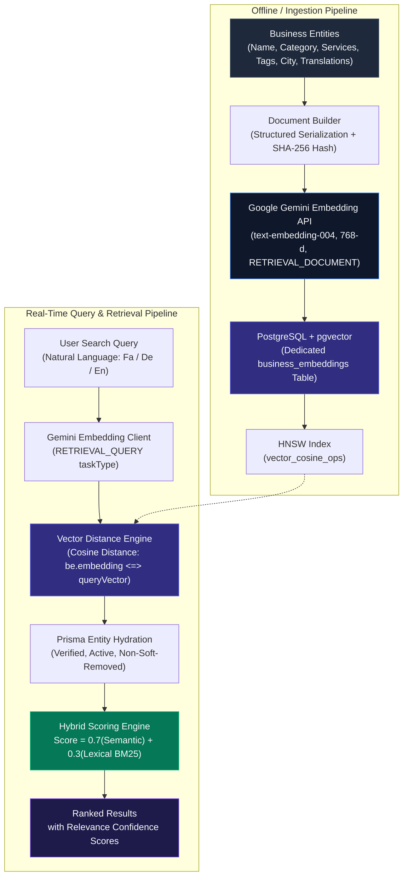

# WoYab (Fargo) — Enterprise Production Monorepo

[-blue.svg)](#monorepo-architecture)
[-black.svg)](apps/frontend)
[](apps/api)
[](packages/database)
[](#-multilingual-semantic-search--rag-retrieval-augmented-generation)
[](deploy)
[](docs/business-claiming-and-moderation.md)

WoYab is an enterprise-grade, high-performance business discovery and directory platform engineered for the multilingual diaspora community (Persian, German, English). Built as an end-to-end production system, it features real-time search, server-side directory taxonomy, business claiming and moderation workflows, automated disaster-recovery pipelines, and zero-downtime deployment.

---

## 📑 Table of Contents
1. [Monorepo Architecture](#-monorepo-architecture)
2. [Multilingual Semantic Search & RAG Architecture](#-multilingual-semantic-search--rag-retrieval-augmented-generation)
3. [DevOps, Runtime Tuning & SRE](#-devops-runtime-tuning--sre)
4. [Enterprise Security, Verification & GDPR](#-enterprise-security-verification--gdpr)
5. [Advanced SEO & Server-Side Directory Taxonomy](#-advanced-seo--server-side-directory-taxonomy)
6. [Tech Stack Breakdown](#-tech-stack-breakdown)
7. [Engineering Standards & Test Automation](#-engineering-standards--test-automation)

---

## 🏗 Monorepo Architecture

The repository is structured as a type-safe, decoupled monorepo managed via **PNPM Workspaces**:

```
fargo/
├── apps/
│   ├── frontend/         # Next.js 15 (App Router, React Server Components, Trilingual i18n, PWA)
│   ├── api/              # Express.js + TypeScript REST API (Domain Services, Auth, Rate Limiting)
│   └── mobile/           # React Native (Expo) mobile client consuming core REST APIs
├── packages/
│   ├── database/         # Prisma Schema, Database Migrations, Multi-tenant / Extension Configs
│   └── shared/           # Cross-package TypeScript interfaces, validation schemas, and utilities
├── deploy/               # Blue-Green runner (release.py), Caddy proxy, Compose definitions, Systemd timers
├── docs/                 # Engineering guides, ownership moderation specs, API boundary documentation
├── plans/                # High-level architecture and RAG execution blueprints
└── reports/              # Production audits and technical SEO competitor benchmarks
```

---

## 🧠 Multilingual Semantic Search & RAG (Retrieval-Augmented Generation)

> **Architectural Specification & Blueprint:** See full engineering design in [`plans/semantic-search-and-rag.md`](plans/semantic-search-and-rag.md).

WoYab implements a hybrid retrieval engine designed to bridge natural language inquiries across three distinct languages (Persian, German, and English). Traditional keyword search (`ILIKE` or standard trigrams) fails when cross-lingual expressions or conversational queries are used (e.g., *"رستوران ایرانی با غذای گیلانی در برلین"* vs *"Persisches Restaurant traditionelle Küche Berlin"*). 

The platform employs **Vector Similarity Search (pgvector) + Hybrid Lexical Reranking + RAG Document Synthesis**:



### Key Technical Pillars of the RAG Architecture:

1. **Embedding Model Selection (`text-embedding-004`):**
   - 768 dimensions provide high semantic density while minimizing memory and index footprint.
   - Asymmetric retrieval: Employs `RETRIEVAL_DOCUMENT` during batch indexing and `RETRIEVAL_QUERY` during search.
   - Native multilingual cross-alignment between Persian, German, and English without machine-translation hops.

2. **In-Database Vector Engine (`pgvector` + HNSW Indexing):**
   - Co-located with the primary PostgreSQL database to guarantee transactional consistency (ACID) on cascade deletes and updates.
   - **HNSW (Hierarchical Navigable Small World)** index with `vector_cosine_ops` (`m = 16`, `ef_construction = 64`) for sub-10ms nearest neighbor resolution.
   - Vectors are isolated in a dedicated `business_embeddings` table to ensure table scans on core entities remain lightweight.

3. **SHA-256 Change Detection & Invalidation:**
   - Ingestion calculates a deterministic SHA-256 digest over aggregated text components.
   - Invalidation hooks only invoke upstream embedding APIs when attributes or translations have materially changed, preventing redundant API cost and latency.

4. **Hybrid Scoring Strategy:**
   - Evaluates a composite score:
     $$\text{FinalScore} = (0.7 \times \text{SemanticSimilarity}) + (0.3 \times \text{LexicalRank})$$
   - Preserves high precision for exact brand and telephone matches while providing broad semantic recall for thematic or descriptive queries.

---

## ⚡ DevOps, Runtime Tuning & SRE

The deployment infrastructure is designed for resilient, low-footprint operation on resource-constrained nodes (2GB–4GB VPS) without compromising availability or fault tolerance.

### 1. Zero-Downtime Blue-Green Deployment Runner
* Implemented via [`deploy/release.py`](deploy/release.py) with slot-based orchestration (Blue/Green container pairs).
* **Guarded Transitions:** 
  1. Spawns candidate container slot with immutable image digests.
  2. Executes Docker health probes with circuit-breaker timeouts (`AbortSignal.timeout(3000)`).
  3. Atomically updates Caddy reverse proxy upstream routing.
  4. Applies graceful connection draining (`stop_grace_period: 30s`) before decommissioning inactive slots.

### 2. Node.js Engine & Cgroup Memory Bounds
Production memory limits are tightly governed to prevent out-of-memory (OOM) kernel terminations:
* **API Service:** `--max-old-space-size=96`, `MALLOC_ARENA_MAX=2`, `mem_limit: 256m`.
* **Frontend Service (Next.js):** `--max-old-space-size=256`, `MALLOC_ARENA_MAX=2`, `UV_THREADPOOL_SIZE=2`, `mem_limit: 512m`.
* **Image Concurrency:** Next.js image optimization workers and in-memory cache slots are bounded to prevent memory ballooning during heavy crawler traffic.

### 3. Automated Disaster Recovery & Offsite Replications
* Automated systemd services and timers ([`deploy/woyab-backup-db.service`](deploy/woyab-backup-db.service), [`deploy/woyab-backup-media.service`](deploy/woyab-backup-media.service)).
* Executes compressed PostgreSQL dumps and atomic media manifests via [`deploy/backup.py`](deploy/backup.py).
* Automated remote replication to Google Drive with retention lifecycle enforcement and failure alerting hooks.

---

## 🛡 Enterprise Security, Verification & GDPR

### 1. Business Ownership Claiming & Verification Engine
> Detailed specification: [`docs/business-claiming-and-moderation.md`](docs/business-claiming-and-moderation.md).
* **Cryptographic OTP Verification:** 6-digit OTP generated via secure pseudorandom generators; only cryptographically salted hashes are stored in the database.
* **DNS & MX Domain Validation:** Normalizes and verifies official corporate domains before dispatching verification challenges.
* **Brute-Force & Flood Protection:** Strict 10-minute lockouts after 3 incorrect attempts, cooldown timers, and IP rate-limiting.
* **Dual-Track Moderation:** Direct matching emails trigger automated role promotion (`Owner`), while public domains (e.g., Gmail) or competing claims are routed to an administrative audit queue.

### 2. GDPR Compliance & Privacy Architecture
* **Soft Removal vs. Hard Deletion:** Differentiates business visibility soft-removal (immediate 404, query suppression, media de-linking) from GDPR Article 17 erasure requests.
* **Automated Retention Schedules:** 90-day retention review queues for expired claims, 180-day retention for rejected requests, and German statutory limitation alignment for verified records.
* **Administrator Security:** Mandatory TOTP Two-Factor Authentication (2FA) for privileged routes.

---

## 🌐 Advanced SEO & Server-Side Directory Taxonomy

> Competitor analysis and architectural benchmark: [`reports/seo-competitor-analysis.md`](reports/seo-competitor-analysis.md).

* **Server-Side Rendered (SSR) Taxonomies:** Dynamic route tree for `/[locale]/directory/cities/[city]`, `categories/[category]`, and combination matrices (e.g., `specialties/[specialty]/[city]`).
* **Thin-Content Circuit Breakers:** Combinations require a minimum threshold of verified businesses; invalid or empty slices return strict HTTP 404s to protect crawl budget.
* **Canonical & Indexation Precision:** Faceted search filters (`/businesses?...`) return `noindex, follow` to eliminate duplicate content penalties, while curated directory taxonomy routes remain fully indexable.
* **Search Engine Optimization Standards:**
  * Pagination with independent canonical links (`?page=2` self-canonicals, avoiding page-1 canonical loops).
  * Bidirectional `hreflang` alternates across Persian, German, and English.
  * Sanitized Schema.org JSON-LD output (`CollectionPage`, `ItemList`, `BreadcrumbList`, `LocalBusiness`).

---

## 💻 Tech Stack Breakdown

| Layer | Technologies |
| :--- | :--- |
| **Monorepo Management** | PNPM Workspaces, Turbo, Node.js `>=22.13.0` |
| **Frontend Web App** | Next.js 15 (App Router), React 19, React Server Components (RSC), Tailwind CSS, DaisyUI, PWA |
| **Mobile App** | React Native, Expo |
| **API Services** | Express.js, TypeScript, Zod, Auth.js (NextAuth), Resend SDK |
| **Database & ORM** | PostgreSQL 16+, `pgvector`, Prisma ORM |
| **AI & Vector Search** | Google Gemini `text-embedding-004`, Cosine Distance HNSW Indexing |
| **DevOps & Proxy** | Docker (Multi-stage builds), Docker Compose, Caddy 2, Python Automation |
| **Observability & SRE** | Sentry (Client, Server & Edge runtimes with monitoring tunnel), JSON-file log rotation |

---

## 🧪 Engineering Standards & Test Automation

The codebase enforces strict quality boundaries through continuous static analysis and automated regression suites:

* **TypeScript Strict Mode:** Enforced across all apps and workspace packages.
* **API Security Boundary Tests:** Validates read-only guarantees on unauthenticated Express routes and ensures write mutations require authenticated Next.js server actions.
* **Claim Policy Regressions:** Unit and integration suites verifying OTP expiration, replay protection, and administrative state machines.
* **SEO Render Verification:** Automated tests validating SSR status codes, reciprocal hreflang consistency, and script-tag injection sanitization in JSON-LD payloads.

```bash
# Execute monorepo test suites
pnpm --dir apps/api test
pnpm --dir apps/frontend test
```
