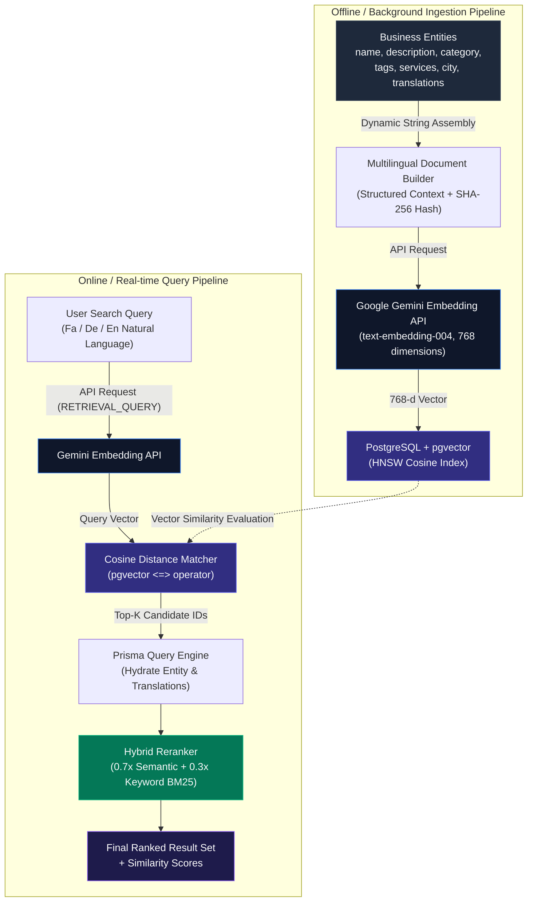

# Architecture & Execution Plan: Multilingual Semantic Search & RAG (Retrieval-Augmented Generation)

## Executive Summary
This document specifies the technical architecture, schema designs, vector store integration, and execution roadmap for adding **Multilingual Semantic Search and Retrieval-Augmented Generation (RAG)** to the WoYab platform. 

The system enables natural language queries across Persian, German, and English (e.g., *"A Persian restaurant near Berlin offering Gilaki dishes"* or *"Persischsprachiger Zahnarzt für Kinder"*), retrieving highly relevant business entities through vector embeddings and hybrid ranking.

---

## Core System Architecture



---

## Key Technical Decisions

### 1. Embedding Model: Google Gemini `text-embedding-004`
* **Dimensions:** 768 dimensions (optimal balance between semantic fidelity and RAM/storage overhead).
* **Cross-Lingual Capabilities:** Native multilingual support with high semantic alignment between Persian, German, and English semantic spaces.
* **Task Types:** Employs `RETRIEVAL_DOCUMENT` during batch indexing and `RETRIEVAL_QUERY` during real-time retrieval for asymmetric search optimization.
* **Cost & Throughput:** Free tier covers up to 1,500 requests/minute, requiring zero GPU overhead on low-resource VPS nodes.

### 2. Vector Store: `pgvector` on Existing PostgreSQL
* **Co-location:** Eliminates dedicated vector database infrastructure (Pinecone, Qdrant, Milvus), utilizing existing managed PostgreSQL.
* **ACID Transactions:** Vector records cascade and synchronize with business updates within atomic database transactions.
* **Indexing Engine:** **HNSW (Hierarchical Navigable Small World)** with `vector_cosine_ops` for sub-millisecond approximate nearest neighbor (ANN) retrieval.
* **Dedicated Embedding Table:** Keeps 3KB vector payloads out of the primary `Business` table to preserve general query and scan performance.

### 3. Change Detection & Cache Invalidation
* Each document computes a cryptographic **SHA-256 hash** over all serialized business attributes and translations.
* Ingestion updates embeddings only when the content hash changes, eliminating redundant API round-trips and processing costs.

---

## Database Schema & Migrations

### Prisma Schema Extension (`packages/database`)

```prisma
// packages/database/prisma/schema.prisma

generator client {
  provider        = "prisma-client-js"
  output          = "../../generated/prisma"
  previewFeatures = ["partialIndexes", "postgresqlExtensions"]
}

datasource db {
  provider   = "postgresql"
  extensions = [vector, pgcrypto]
}

model BusinessEmbedding {
  id            String   @id @default(cuid())
  businessId    String   @unique
  embedding     Unsupported("vector(768)")
  documentHash  String   @db.VarChar(64)
  model         String   @default("text-embedding-004")
  createdAt     DateTime @default(now())
  updatedAt     DateTime @default(now()) @updatedAt
  business      Business @relation(fields: [businessId], references: [id], onDelete: Cascade)

  @@index([businessId])
  @@map("business_embeddings")
}
```

### Raw PostgreSQL Migration: Extension & Indexing

```sql
-- Enable vector extension
CREATE EXTENSION IF NOT EXISTS vector;

-- Create HNSW cosine similarity index
CREATE INDEX IF NOT EXISTS business_embeddings_hnsw_idx 
ON business_embeddings 
USING hnsw (embedding vector_cosine_ops)
WITH (m = 16, ef_construction = 64);
```

---

## Document Synthesis Architecture

To maximize cross-lingual retrieval accuracy, the document builder aggregates structured business fields into a normalized text corpus:

```typescript
// packages/shared/src/ai/document-builder.ts

import { createHash } from "node:crypto";

export interface BusinessEntityContext {
  id: string;
  businessName: string;
  categoryNameEn: string;
  categoryNameFa: string;
  categoryNameDe: string;
  subCategoryNameEn?: string;
  subCategoryNameFa?: string;
  subCategoryNameDe?: string;
  shortDescription?: string;
  description?: string;
  cityNameEn: string;
  cityNameFa: string;
  services: string[];
  tags: string[];
  translations: Array<{
    locale: string;
    businessName?: string;
    shortDescription?: string;
    description?: string;
  }>;
}

export function buildBusinessDocument(business: BusinessEntityContext): {
  text: string;
  hash: string;
} {
  const sections: string[] = [];

  // 1. Multilingual Names
  const names = new Set([business.businessName]);
  for (const t of business.translations) {
    if (t.businessName) names.add(t.businessName);
  }
  sections.push(`Name: ${Array.from(names).join(" | ")}`);

  // 2. Taxonomy Hierarchy
  sections.push(
    `Category: ${business.categoryNameEn} / ${business.categoryNameDe} / ${business.categoryNameFa}`
  );
  if (business.subCategoryNameEn) {
    sections.push(
      `Subcategory: ${business.subCategoryNameEn} / ${business.subCategoryNameDe} / ${business.subCategoryNameFa}`
    );
  }

  // 3. Location
  sections.push(`Location: ${business.cityNameEn} / ${business.cityNameFa}`);

  // 4. Offerings and Tags
  if (business.services.length > 0) {
    sections.push(`Services: ${business.services.join(", ")}`);
  }
  if (business.tags.length > 0) {
    sections.push(`Keywords & Tags: ${business.tags.join(", ")}`);
  }

  // 5. Narrative Descriptions
  if (business.shortDescription) sections.push(business.shortDescription);
  if (business.description) sections.push(business.description);
  for (const t of business.translations) {
    if (t.shortDescription) sections.push(t.shortDescription);
    if (t.description) sections.push(t.description);
  }

  const text = sections.join("\n").trim();
  const hash = createHash("sha256").update(text).digest("hex");

  return { text, hash };
}
```

---

## Vector Search Query Implementation

```typescript
// apps/api/src/repositories/business-semantic-search.repository.ts

import { PrismaClient } from "@fargo/database";

export interface SemanticSearchResult {
  businessId: string;
  similarityScore: number;
}

export async function searchSimilarBusinesses(
  prisma: PrismaClient,
  queryVector: number[],
  options: {
    limit?: number;
    categoryId?: number;
    cityId?: number;
    minScore?: number;
  }
): Promise<SemanticSearchResult[]> {
  const limit = options.limit ?? 10;
  const minScore = options.minScore ?? 0.45;
  const vectorString = `[${queryVector.join(",")}]`;

  return prisma.$queryRaw<SemanticSearchResult[]>`
    SELECT
      be."businessId" AS "businessId",
      (1 - (be.embedding <=> ${vectorString}::vector)) AS "similarityScore"
    FROM business_embeddings be
    JOIN businesses b ON b.id = be."businessId"
    WHERE b.status = 'ACTIVE'
      AND b.verified = TRUE
      AND b."removedAt" IS NULL
      AND (${options.categoryId}::int IS NULL OR b."categoryId" = ${options.categoryId})
      AND (${options.cityId}::int IS NULL OR b."cityId" = ${options.cityId})
      AND (1 - (be.embedding <=> ${vectorString}::vector)) >= ${minScore}
    ORDER BY be.embedding <=> ${vectorString}::vector ASC
    LIMIT ${limit};
  `;
}
```

---

## Hybrid Search Ranking Strategy

To combine exact token matching (e.g. brand names, phone prefixes) with conceptual similarity, the final scoring engine calculates a weighted composite score:

$$\text{FinalScore} = (\alpha \times \text{SemanticScore}) + ((1 - \alpha) \times \text{FullTextScore})$$

* Default $\alpha = 0.70$ (70% semantic similarity, 30% lexical exact matching).
* Full-text score derived from PostgreSQL `ts_rank` using `pg_trgm` and `to_tsvector`.

---

## Execution Roadmap

| Phase | Scope & Deliverables | Verification Criteria |
| :--- | :--- | :--- |
| **Phase 0: Infrastructure** | Enable `pgvector`, compile schema migration, configure Gemini credentials. | `SELECT vector_dims('[1,2,3]'::vector);` returns 3. |
| **Phase 1: Ingestion Engine** | Implement Document Builder, SHA-256 hasher, and Gemini API client. | Unit tests pass for string serialization and vector parsing. |
| **Phase 2: Batch Indexer** | Resumable CLI script (`embeddings:index`) with rate-limiting and progress tracking. | 100% of verified business entities indexed in DB. |
| **Phase 3: Search Endpoint** | `POST /v1/businesses/semantic-search` with cosine filtering and Prisma hydration. | Integration test returns relevant businesses for Fa/De/En queries. |
| **Phase 4: Real-time Sync** | Asynchronous post-mutation hooks for entity creation/updates. | Updating a business profile recalculates embedding within 5s. |
| **Phase 5: UI & RAG Expansion** | Natural language search bar with debounced requests + optional LLM conversational assistant. | Client search returns contextual cards with match scores. |

---

## Operational Security & Resource Budget

* **Storage Overhead:** 768 floats $\times$ 4 bytes $\approx$ 3.07 KB per business. 2,000 entities consume $\approx$ 6.1 MB payload + 12 MB HNSW index overhead (total $<20$ MB).
* **API Rate Limits:** Monitored against Google AI Studio quotas (1,500 RPM for embedding endpoints).
* **Fault Tolerance:** Immediate fallback to PostgreSQL full-text search if the upstream embedding provider experiences latency or outages.
